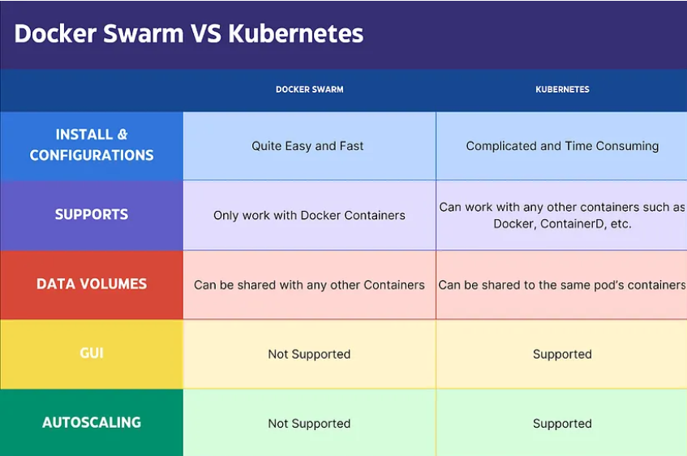

Why Kubernetes? 
    It helps in solving the main problems that Docker has for containarization.

    Downsides of Docker:
    1) Simple (no load balancing, firewalls, Security)
    2) Runs on single host - with many containers on single host.
        Problem: When many containers are running on single host, if there are 100 conatiners and the kernel has some logic to run the containers, as it can't simply run the random container. So according to logic it runs a container and if the container takes more use of resources which will effect the smooth running of some 'x' container by the host. So the whole things gets into mess, as we can't monitor manually if there are large no-of container in real time. Where as Kubernetes can solve this problem as it operaters on cluster level - which will be having many nodes and kubernetes can detect the faulty container and trnasfers that container to seperate node, so it doen't affect the performance.

    3) Auto scaling 
        Problem: In Docker there is no such thing called auto scaling. Where as kunernetes can solve the issue with HPA(Horizontal pods autoscaling), here we could set up a threshold frequesncy of 80% or 90% so it could spin a new pod by itself when the current pod reaches that mentioned threshold. Kubernetes works on YAML files, you can go to replica files and manually you could specify the autoscalling by how many times as per traffic.

    4) Auto healing:
        Problem: In docker there is a high chance of a container to die as it is Ephemeral in nature (short span). In Docker it is not able to heal by itself. Kubernetes has autohealing feauture, when it detects some issue with existing container/pod it rolls out new container in place of old one. Whenever a new container is rolled the end user will not even know that it has rolled a new container.

    5) Docker doesn't support any enterprise level support. where as in kubernetes we have many contributions and adoptions by CNCF which is major advantage of kubernetes and would support majorly for all the advanced options like (load balancing, firewalls, security)

Advantages of kubernetes, which is covering disadvantages of Docker?

    Basically Kubernetes is orchestation platform which works on containers. Docker is one of the popular tool for containerization, and kubernetes works on concept of pods, on top of container hence majorly, we discuss the in generalized format of Kubernetes with Docker.

    Advantages:
    1) Cluster type than single host - operates as master nodes and worker nodes
    2) Auto scaling - HPA (Horizontal pod auto-scaling)
    3) Auto healing - Rolls a new pod if it finds a fault in any pod.
    4) Enterprise level support - advance load balancing, security, advanced networking.

