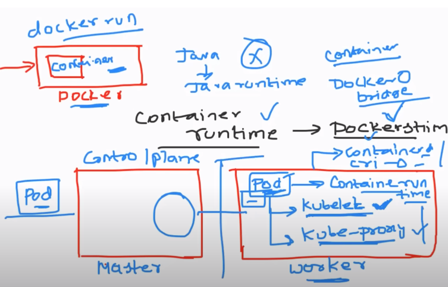

K8s Architecture:

    Kubernetes mainly has control plane and Data plane 
    1) Control plane 
        a) API Server
        b) ETCD - key value storage, which is backup for cluster info.
        c) Scheduler
        d) Controller manager
        e) cloud controller manager

    2) Data Plane
        a) Kubelet
        b) kube Proxy 
        c) container runtime

    We will understanding all these things with Docker. Basic component in Docker is container and basic component in Kubernetes is POD.

    same as Java while running java code we need java run time, in the same way when we create Docker file, build image and run image inside container, we need "container run time" which will help in running container called "Docker Stim". 

    Where as in Kubernetes, we create a master node and worker node, we could also have multiple masters and multiple workers. For now we will create one master, one worker...

    In kubernetes, request always goes through master (control plane) and we user tries to deploy a POD, the POD is deployed on worker node but the component "Kubelet" is responsible for running POD. Same as Docker Stim in Docker Engine.

    Kubelet take cares of maintainance of PODs. Inside POD we have container and so we have container runtime which is container stim.

    The components in worker node of kubernetes is 
        1) Kubelet - responsible for maintaiance of POD and gives info about POD. If any issue with the POD, it will inform the component in master node called API server.
        2) Container runtime (container stim/container d/cri-o) - 
        3) Kube-proxy - provides the networking, evry pod created should have IP, load balancing. So kube-proxy take cares of assigning IP and managing load.
        It uses IP tables for network configurations.

    API server is componennt which helps in exposing it to external world. Apart from API server every component is internal which are part of Data plane.

    Now, API server is heart of kubernetes server which takes all requests from external world. It decides everything and there are different components to deliver the decesion taken by API server.

    In the same way if a request is created by user to create POD and he access the API server, then API server decides on which worker node it has to run and to run this POD, API server has component called Scheduler, which schedules the PODS/resources on Kubernetes.

    NOTE: Kube-scheduler acts on the request but decided by API server.

    The components in worker node of kubernetes is 
        1) API Server - heart, decider
        2) Kube-Scheduler - acts upon deceion taken by API server
        3) ETCD - key value storage, which is backup for cluster info.
        4) Controller manager - Kubernetes to support autoscaling and other stuff, it has some controllers.
        ex: Replica set - which ensures the components are running.
        5) cloud controller manager -  

    CCM:

        There is lot of confusion with this concept. So, as we all know that Kubernetes can be run on cloud platforms like EKS, AKS or GKE. 

        So what is happening when you are running your Kubernetes on cloud platforms?
        So basically, these cloud platforms, let's say you're using elastic Kubernetes service (EKS). So there is a user request, or there is a request to create a load balancer or there is a request to create storage. if we directly send this information to Kubernetes, it has to understand the underlying cloud provider and Kubernetes has to create a load balancer/storage on AWS (EKS), or Azure kubernetes service (AKS), So Kubernetes has to translate the request from the user onto the API request that your cloud provider understands. So this mechanism has to be implemented on your Cloud Control Manager. 
        
        That means to say, let's say tomorrow, there is a new cloud that is implemented called as harsha_cloud and we want to run Kubernetes on this platform called as harsha_cloud. 

        Now, what Kubernetes tells you is that okay, I cannot write logic for all of these different cloud providers. I will provide you a component called as cloud controller manager. So this cloud controller manager is a open source utility for which the code is available on GitHub. 
        
        Tomorrow, if harsha creates a new cloud provider, what harsha can do is he can go to this open source GitHub repository, and he can write the logic for his cloud provider. Inside this cloud controller manager (CCM). He can create a pull request to the cloud controller manager saying that okay, so I have implemented a new cloud. And I want, I want to support Kubernetes on my cloud provider. So for that reason, what harsha has to do is he has to write a bunch of logic and he has to submit to cloud controller manager. 

        If you are running Kubernetes on-premise, This component is not at all required or this component does not have to be created at all on your Kubernetes cluster. 

    Basically Kubernetes is divided into 2 major componnets-
        1) Worker Node (data plane) - Kubelet, kube -proxy, container runtime
        2) Master Node (control plane) - API server, Kube-scheduler, ETCD, controller manager, cloud controller manager.

        Control plane controlls the actions and data plane executes the actions.

