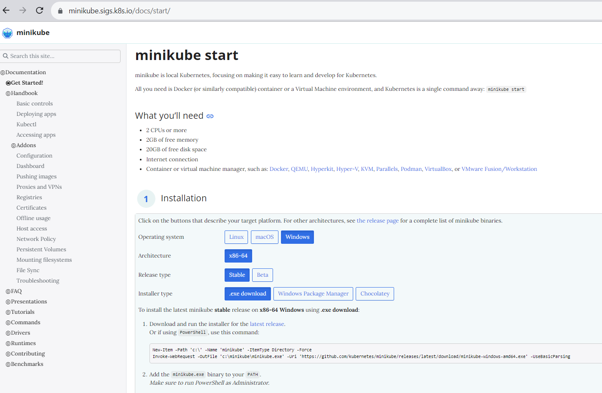
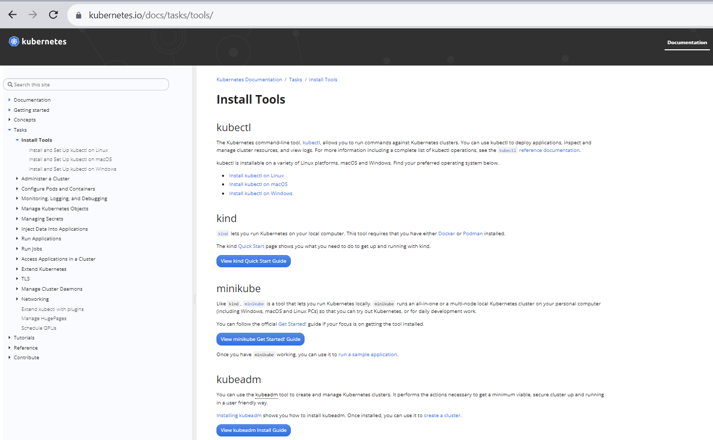

One is, you know, to install a MiniKube and the second thing is to install Kubectl. 
1) MiniKube
2) Kubectl

What is Kubectl?  
Kubectl is your Kubernetes command line. So with which you can interact with your Kubernetes cluster. You can also do it with your Kubernetes UI, or the Kubernetes dashboard, but the most preferred way of doing it is using Kubectl. 

The easiest way is to directly go to switch to the Kubernetes MiniKube official documentation.
https://minikube.sigs.k8s.io/docs/start/

Above is the official documentation and you need to have these prerequisites like  two CPUs to give you a free RAM and 20 GB of free hard disk, and  an internet connection. 

If you want to install MiniKube on any of the platforms like Windows or Mac OS or anywhere, you need to have a hypervisor that is installed.

what is the purpose of hypervisor?
Hypervisor, basically serves for creating a virtual server on top of your laptop or your server. So that's the only prerequisite that that you need to have. It differs from platform to platform. So the first thing that you do is go to the installation process and choose your operating system on which you're on and you can simply download the Minikube and execute the scripts that are available in Minikube documentation.

After installing, you can simply use this command called MiniKube start. So MiniKube start command will start a cluster for you. And you can also pass some parameters like the driver that you want to use and all but the basic commands that you can do is MiniKube start.

Second step, Instal Kubectl. Kubectl can be easily downloaded. So again, go to the official Kubernetes documentation and search for the install tools and you can download the Kubectl binary of the operating system (windows in our case). 

https://kubernetes.io/docs/tasks/tools/

Now your Kubectl would be configured to the Kubernetes cluster that they're using. And you can execute your Kubernetes commands. 

And there are other instructions of how you can operate with your MiniKube cluster like you can pass your limited cluster or you can unpause your mini cluster. You can stop the cluster whenever you not require this or for any other reasons you can stop the MiniKube cluster. And you can create multiple clusters with the same single MiniKube instance like you know, you can create a development cluster and you can create a testing cluster you can do multiple clusters with MiniKube and you can also set the different configurations you can increase the memory or you can do different things here. 

So this type of MiniKube command maybe when you look into the all the options that we have. One more important thing about MiniKube is it supports a lot of add ons so that you can install add ons like your ingress controller operator lifecycle manager for which you can install operators and you can do different things with MiniKube add ons. 